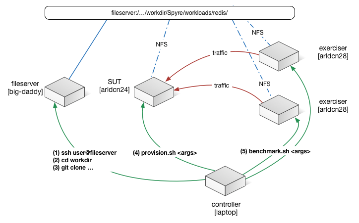

# Redis

This directory contains multiple provisioning methods to run the Redis benchmark ([#1](#1)).


## Provisioning

The provisioning method makes a few assumptions:

* you have two or more machines,
	* one to work as the *SUT* (System Under Test) that will be uset to run your code, and
	* the remaining machines as *exercisers*, which will initiate work on the *SUT*.
* you will control all machines from your development system (e.g., laptop)
* you have a filesystem visible by all machines (*SUT* and *exercisers*).
* ideally this filesystem will also be visible by your development system.
* [Requirements]()



Once you verify the previous assumptions are valid for your case, go ahead and provision the system. The supported versions of the benchmark are:

* bare: files to run on a dedicated machine, without virtualization or containers of any kind
* container: files to create containers, and run the benchmark out of them.
* vm: [not yet]

The recommended flow is:

* build the binaries with ```build```,
* provisioning it with ```provision```,
* test it with ```benchmark```,
* cancel an existing run ```reset```.


## Build

The ```build``` script grabs a version of the Redis source code directly from their website.  It then builds it in the *SUT* machine (or a different one of your choosing).  Syntax:

	./build [--machine=host] [--dir=directory]

If you do not specify a directory, the script will:

* connect to the build machine,
* create a temporary directory,
* fetch the corresponding packages,
* build the corresponding files,
* create a tarball of this temporary directory,
* bring it back to the control machine,
* remove the temporary directory.

If you specify a directory, the script will leave the intermediate files in the remote machine.  This is useful for those cases where the machines operate with a common network filesystem, or if you want the build machine to *cache* the binaries.  It's your decision.


## Provision

Now that you have the binaries, you need to deploy your *application* on the *SUT*.  For that you need to use the ```provision``` script.  This script will take care of copying the binaries, configuration files and data (if applicable) to the *SUT* for the *bare* deployment.  It will also take care of building the image for the *container* or *vm* cases.  The syntax is:

	./provision --mode={bare|container|vm} --sut={host} [--options]


## Benchmark

Syntax:

	./benchmark --sut={host} --exerciser={host}


## Reset

We use this to cancel a running benchmark (i.e., stop the *exercisers*), and if you choose, to reset the *SUT*.

	./reset [--sut]


## Requirements

The orchestration uses **ansible** in your *controller* machine. See the [ansible installation](http://docs.ansible.com/intro_installation.html).


## Sources

* [1]: [Redis Benchmark](http://redis.io/topics/benchmarks)


===


#Attic


### BML

To build the benchmark:

	./bml/build.sh

To run the benchmark:

	./bml/benchmark.sh --server=host1 --server-n=n --client=host2 --clients-per-server=n

To force the benchmark to end:

	./bml/benchmark-abort.sh --server=host1 --client=host2

To collect benchmarking data:

	./bml/benchmark-data.sh --client=host2


### Container

Run ```build-docker-images.sh``` to build the image
for the container.
You will end up with 2 Docker images tagged as *base* and *redis*.

The *base* container is just:

* an Ubuntu (13.04 Saucy) container,
* plus ssh, screen and supervisor

The *redis* container:
* *base* conainer,
* plus redis-server.

### Benchmarking

* Run ```redis-start.sh```, to start a fresh container running the redis server.
* Run ```redis-benchmark.sh```, to run the test agains the redis server you just started.  Once the test ends, this container stops.
* Run ```redis-stop.sh```, to stop the redis server you started initially.
